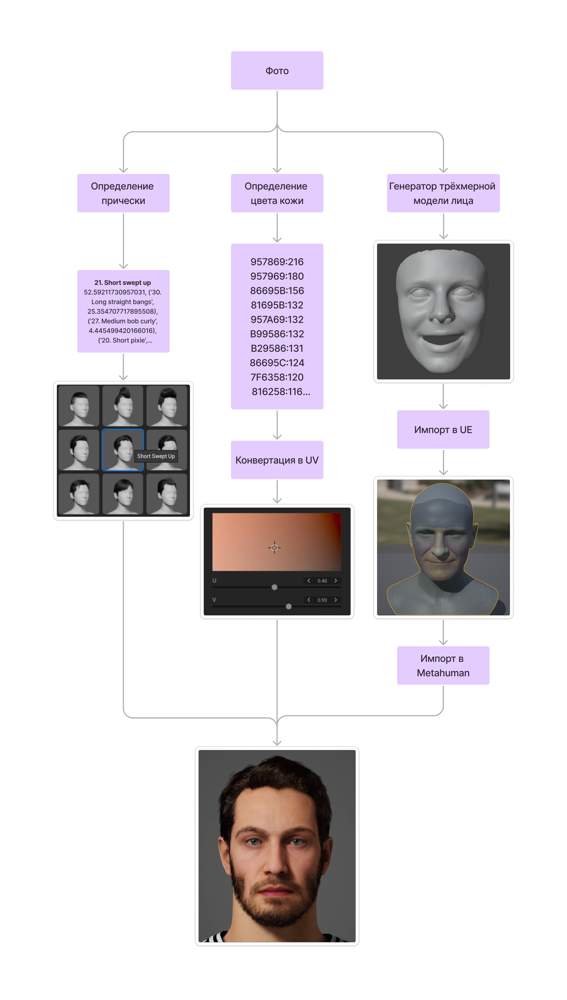

# Генерация параметров генератора аватаров

Здесь представленн код системы подбирающий параметры для генератора аватаров, которые можно вставить в [Metahuman Creator](https://metahuman.unrealengine.com/). В рамках этой работы были рассмотрен подбор следующих параметров: форма лица, причёска и оттенок кожи.

Разработан в рамках магистерской работы в [ИТМО](https://itmo.games/) по программе ["Технологии разработки компьютерных игр"](https://itmo.games/). 

Исходный код [храниться на GitHub](https://github.com/catinapoke/AvatarParameters).

## Описание алгоритма

Ниже на картинке визуально представлен алгоритм работы всех модулей вместе, работа с которым описана ниже. Изначально запускается модуль определения формы лица, где получается трёхмерная модель, которая далее импортируется в генератор аватаров. Далее модуль определения прически и модуль оттенка кожи. На каждом из этапов показан вывод модулей.




## Связанные репозитории

 * [Deep3DFaceRecon Pytorch](https://github.com/sicxu/Deep3DFaceRecon_pytorch) для генерации трёхмерного лица(3D face reconstruction) и последующего импорта в Metahuman.
 * [TIMM](https://github.com/huggingface/pytorch-image-models) для тренировки и запуска нейронной сети по распознаванию причёсок.
 * [K-Hairsyle](https://psh01087.github.io/K-Hairstyle/) как набор данных причесок
 * [Color Invariant Skin Segmentation](https://github.com/hanxumartin/color-invariant-skin-segmentation) - наилучшее решение среди испробованных в определении маски кожи человека.


## Настройка окружения и запуск

Этот проект состоит из нескольких модулей. Ниже представлены шаги по выставлению пайплайна работы.

### Подготовка окружения
1. Скачайте текущий репозиторий
    ```bash
    git clone https://github.com/catinapoke/AvatarParameters
    ```
2. Скачайте [Deep3DFaceRecon Pytorch](https://github.com/sicxu/Deep3DFaceRecon_pytorch) в папку Deep3DFaceRecon и настройте по инструкции указанной в репозитории
3. [Подгрузите модель EfficientNet](https://disk.yandex.ru/d/NeidCuhrbxuwJg), которая была натренированна в ходе данной научной работы
3. Скачайте [Color Invariant Skin Segmentation](https://github.com/hanxumartin/color-invariant-skin-segmentation) в соответсвующую папку, но без перезаписи файлов
4. Скачайте [Blender](https://www.blender.org/), он пригодиться для конвертации модели после работы Deep3DFaceRecon Pytorch
5. Скачайте [Unreal Engine 5](https://www.unrealengine.com/en-US/unreal-engine-5) и создайте пустой проект

### Выполнение генерации
Для запуска нужно проделать следующие шаги
1. Выполнение шага генерации. Здесь будет получена промежуточная 3d модель лица.
    ```bash
    cd Deep3DFaceRecon_pytorch/
    conda activate deep3d_pytorch
    
    python convert.py --input='./in' --output='./out'
    ```
2. Далее запускаем конвертацию полученной модели в нужный нам формат. Позже эту модель и текстуру нужно будет импортировать.
    ```bash
    cd blenderConverter
    python ./main.py -i='{ваша корневая папка}/Deep3DFaceRecon/out' -b='{путь до Blender}/blender.exe'
    ```
3. Запуск модуля определения типа прически. Будет выдан номер и название прически в консоль
    ```bash
    cd timm
    python main.py --img_path='1.jpg'
    ```
4. Запуск модуля определения оттенка кожи. Будет выдан список цветов в формате `RGB:количество`, цвет с наибольшим значением - искомый оттенок кожи. До старта необходимо поместить фото в `Color-Invariant-Skin-Segmentation/U-Net/test_images`
    ```bash
    cd Color-Invariant-Skin-Segmentation/U-Net/
    python test.py
    ```

5. После выполнения предыдущих шагов и получения необходимых результатов, нужно создать Unreal Engine проект, добавить туда [плагин Metahuman Creator](https://www.unrealengine.com/marketplace/en-US/product/metahuman-plugin) и импортировать полученный меш с текстурой с помощью [руководства](https://dev.epicgames.com/documentation/en-US/metahuman/mesh-to-metahuman-quick-start-in-unreal-engine)
6. После импорта нового аватара нужно зайти в [панель Metahuman Creator](metahuman.unrealengine.com) и выбрать его, после чего выставить необходимые параметры
